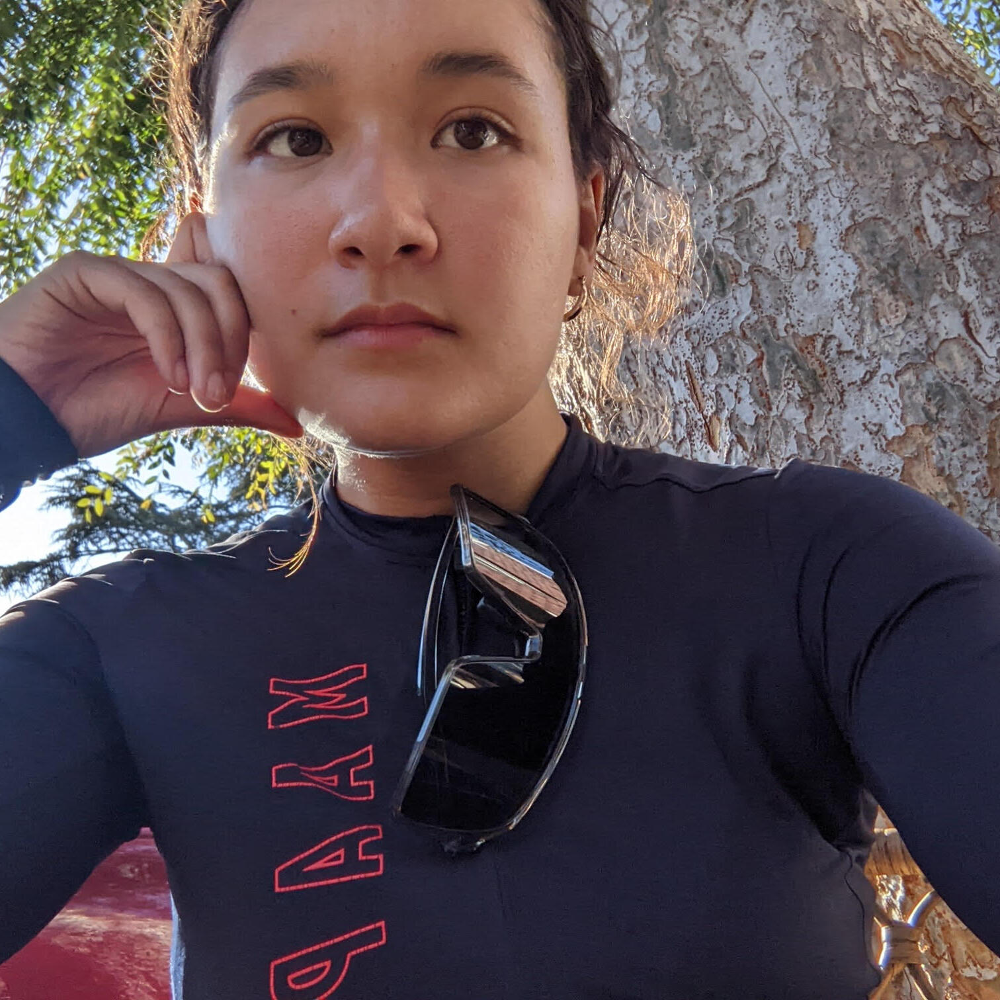

  

    <h2>About Me</h2>

    
Hi! 👋

    
I’m Oona, a PhD student in computational biology @ Cornell (undergrad in statistics at UC Berkeley).

    
I work at the interface of machine learning, public health, and genomics.

    
I have a background in human and statistical genetics and prior drug-discovery experience at Genentech and Novo Nordisk; I’m currently building interpretable models for population-scale data and extending them to environmental metagenomics and genomic epidemiology (mainly in wastewater).

  

  <aside class="about-side">
    
    <!-- <ul class="profile-links">
	<li><a href="https://scholar.google.com/citations?user=xi7fXeQAAAAJ&hl=en" aria-label="Google Scholar">Google Scholar</a></li>
    	<li><a href="https://github.com/oonashigenorisseadams" aria-label="GitHub">GitHub</a></li>
    	<li><a href="https://www.linkedin.com/in/oonarisse-adams/" aria-label="LinkedIn">LinkedIn</a></li>
    	<li><a href="https://x.com/oonarisseadams" aria-label="Twitter">Twitter</a></li>
    </ul> -->
     <ul class="profile-links">
  <!-- Google Scholar -->
  <li>
    <a href="https://scholar.google.com/citations?user=xi7fXeQAAAAJ&hl=en" aria-label="Google Scholar" title="Google Scholar" target="_blank" rel="noopener">
      <svg viewBox="0 0 24 24" class="icon" role="img" aria-hidden="true">
        <path d="M12 3 1 8l11 5 8-3.6V15h2V8L12 3zm-5 9.5v3c0 1.9 3.1 3 5 3s5-1.1 5-3v-3l-5 2.3-5-2.3z"/>
      </svg>
      Google Scholar
    </a>
  </li>

  <!-- GitHub -->
  <li>
    <a href="https://github.com/oonashigenorisseadams" aria-label="GitHub" title="GitHub" target="_blank" rel="noopener">
      <svg viewBox="0 0 24 24" class="icon" role="img" aria-hidden="true">
        <path d="M12 .5a11.5 11.5 0 0 0-3.64 22.41c.58.11.8-.25.8-.57v-2.04c-3.26.71-3.95-1.58-3.95-1.58-.53-1.35-1.28-1.71-1.28-1.71-1.05-.72.08-.71.08-.71 1.18.08 1.8 1.21 1.8 1.21 1.05 1.8 2.75 1.28 3.42.98.1-.75.4-1.29.73-1.59-2.6-.3-5.33-1.3-5.33-5.8 0-1.28.46-2.34 1.22-3.16-.12-.31-.53-1.53.12-3.17 0 0 1-.32 3.27 1.24a11.5 11.5 0 0 1 5.98 0c2.27-1.56 3.27-1.24 3.27-1.24.66 1.64.24 2.86.12 3.17.76.82 1.22 1.88 1.22 3.16 0 4.52-2.74 5.49-5.35 5.79.42.36.82 1.07.82 2.19v3.24c0 .33.2.7.81.58A11.5 11.5 0 0 0 12 .5z"/>
      </svg>
      GitHub
    </a>
  </li>

  <!-- LinkedIn -->
  <li>
    <a href="https://www.linkedin.com/in/oonarisse-adams/" aria-label="LinkedIn" title="LinkedIn" target="_blank" rel="noopener">
      <svg viewBox="0 0 24 24" class="icon" role="img" aria-hidden="true">
        <path d="M4.98 3.5A2.48 2.48 0 1 1 0 3.5a2.48 2.48 0 0 1 4.98 0zM.5 8h4v13.5h-4V8zm7.5 0h3.7v1.85h.05c.52-.99 1.8-2.05 3.7-2.05 3.96 0 4.7 2.6 4.7 6V21.5h-4V15c0-1.55-.03-3.54-2.3-3.54-2.3 0-2.65 1.67-2.65 3.43v6.61h-4V8z"/>
      </svg>
      LinkedIn
    </a>
  </li>

  <!-- Twitter/X (bird icon; happy to swap for X) -->
  <li>
    <a href="https://x.com/oonarisseadams" aria-label="Twitter" title="Twitter" target="_blank" rel="noopener">
      <svg viewBox="0 0 24 24" class="icon" role="img" aria-hidden="true">
        <path d="M23.95 4.57c-.88.39-1.83.65-2.83.77a4.93 4.93 0 0 0 2.16-2.71 9.86 9.86 0 0 1-3.12 1.19 4.92 4.92 0 0 0-8.4 4.49 13.97 13.97 0 0 1-10.1-5.11 4.92 4.92 0 0 0 1.52 6.57 4.9 4.9 0 0 1-2.23-.62v.06a4.92 4.92 0 0 0 3.95 4.82 4.96 4.96 0 0 1-2.22.08 4.93 4.93 0 0 0 4.6 3.42A9.87 9.87 0 0 1 .96 20.1 13.93 13.93 0 0 0 8.52 22.3c9.07 0 14.03-7.51 14.03-14.02 0-.21 0-.42-.02-.63a10.03 10.03 0 0 0 2.42-2.48z"/>
      </svg>
      Twitter
    </a>
  </li>
</ul>

  </aside>

## Research Interests

- **Applied machine learning & causal inference for public health** : models on population-scale real-world and genomic data to inform surveillance, risk prediction, and decision-making
- **Environmental metagenomics & genomic epidemiology** : extract and annotate signals from mixed samples and translate them into pathogen and antimicrobial-resistance inference.
- **Human genetics & mechanistic modeling** : connect host factors with microbial exposures (including host–microbiome protein–protein interactions).

## Publications

1. Boudreau, G.D., et al., 2024. Evaluating Concomitant Medication Use in Cystic Fibrosis Patients Using Real-World Data to Inform Drug–Drug Interaction Risk Assessment and Clinical Trial Design of GDC-6988. American Conference of Pharmacometrics.
2. Jin, Z., and Risse-Adams, O.S., 2021. Secure Audio Watermarking Based on Neural Networks. U.S. Patent 11,170,793 B2. 
[[PDF]](https://patentimages.storage.googleapis.com/c5/0e/7e/38ab245833ccd5/US11170793.pdf)
3. Goddard, P.C., Keys, K.L., Mak, A.C.Y., Lee, E.Y., Liu, A.K., Samedy-Bates, L.A., et al., 2021. Integrative Genomic Analysis in African American Children with Asthma Finds Three Novel Loci Associated with Lung Function. Genetic Epidemiology, 45(2), 190–208. 
[[PDF]](assets/pg_2021.pdf)
4. Contreras, M.G., Keys, K., Magana, J., Goddard, P.C., Risse-Adams, O., et al., 2021. Native American Ancestry and Air Pollution Interact to Impact Bronchodilator Response in Puerto Rican Children with Asthma. Ethnicity & Disease, 31(1), 77. 
[[PDF]](assets/mc_2021.pdf)
5. Magaña, J., Contreras, M.G., Keys, K.L., Risse-Adams, O., Goddard, P.C., et al., 2020. An Epistatic Interaction Between Pre-natal Smoke Exposure and Socioeconomic Status Has a Significant Impact on Bronchodilator Drug sponse in African American Youth with Asthma. BioData Mining, 13(1), 7. 
[[PDF]](assets/jm_2020.pdf)
6. White, M.J., Yaspan, B.L., Veatch, O.J., Goddard, P., Risse-Adams, O.S., et al., 2019. Strategies for Pathway Analysis Using GWAS and WGS Data. Current Protocols in Human Genetics, 100(1), e79.
[[PDF]](assets/strat_2018.pdf)
7. Zeiger, A.M., White, M.J., Eng, C., Oh, S.S., Witonsky, J., Goddard, P.C., et al., 2018. Genetic Determinants of Telomere Length in African American Youth. Scientific Reports, 8(1), 13265.
[[PDF]](assets/az_2018.pdf)
8. White, M.J., Risse-Adams, O., Goddard, P., Contreras, M.G., Adams, J., Hu, D., et al., 2016. Novel Genetic Risk Factors for Asthma in African American Children: Precision Medicine and the SAGE II Study. Immunogenetics, 68(6), 391–400. 
[[PDF]](assets/osra.pdf)
